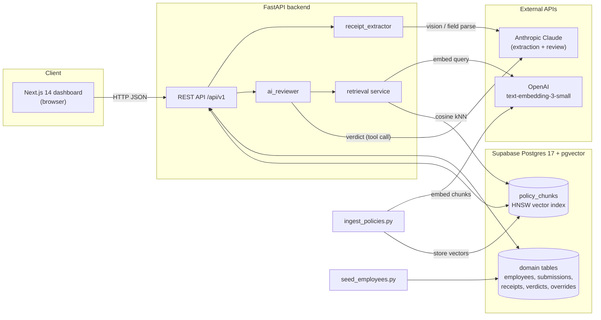
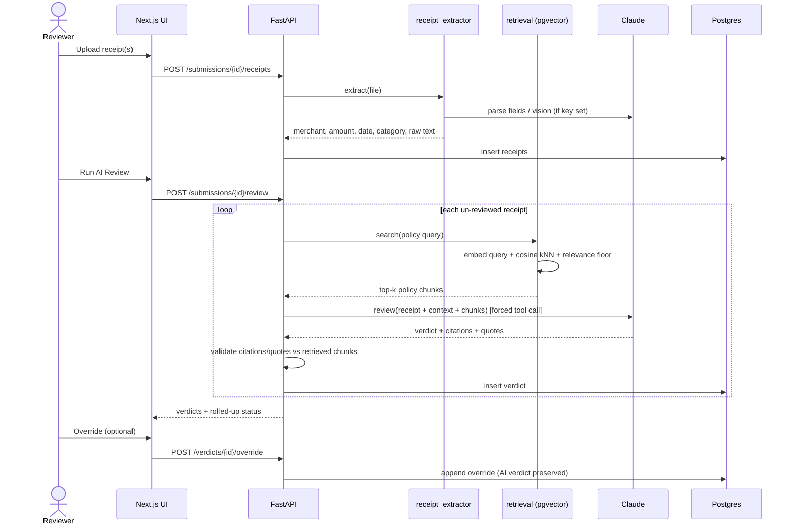

# Northwind Expense AI

An AI-assisted corporate **travel-and-expense (T&E) review** system. Employees submit
expense reports; the system extracts receipt data, retrieves the relevant company
policy via RAG, and asks Claude for a **policy-grounded compliance verdict** that a
human reviewer can inspect and override.

Built as a case study. It runs end-to-end against a real database and the Claude +
OpenAI APIs, with a deliberately scoped feature set — see
[Known limitations](#19-known-limitations) for an honest account of what is and isn't
built.

> **Status at a glance:** backend + frontend run locally against hosted Supabase
> Postgres. **Auth is not implemented**, **review runs synchronously**, **Supabase RLS
> is relaxed for dev**, and **deployment is not included**. Details below.

---

## 1. Project overview

Northwind Logistics processes expense reports that must be checked against a corpus of
written travel policies (per-diems, class-of-service rules, meal caps, etc.). Doing
this by hand is slow and inconsistent. This project automates the first pass:

- **Receipts in** → fields extracted (text/PDF via `pypdf`, images via Claude vision).
- **Policy retrieved** → the most relevant policy chunks are pulled from a pgvector
  index using semantic search.
- **Verdict out** → Claude returns a structured `compliant | flagged | rejected |
  needs_review` decision, **citing only the retrieved policy text**, which the backend
  validates before storing.
- **Human in the loop** → reviewers override any verdict; overrides are append-only and
  never mutate the AI's original decision.

The emphasis is on **grounding and auditability** — every citation and quote is checked
against the retrieved source text server-side, so the model cannot fabricate policy.

## 2. Problem statement

Manual expense review has three recurring problems this project targets:

1. **Inconsistency** — different reviewers apply policy differently. A retrieval-grounded
   model applies the same written rules every time.
2. **Traceability** — approvals rarely record *which* policy clause justified a decision.
   Here, every verdict stores its citations and verbatim quotes.
3. **Throughput** — a first-pass triage (`compliant` vs. `needs a human`) lets reviewers
   focus on the genuinely ambiguous cases.

It is explicitly **decision-support, not auto-approval**: the AI verdict is advisory and
always overridable.

## 3. Key features

- **Receipt extraction** for `.txt`, `.pdf` (pypdf), and `.jpg/.jpeg/.png` (Claude
  vision), using schema-constrained tool calls so the output is always well-shaped JSON.
- **RAG policy retrieval** over ingested policy PDFs with OpenAI embeddings + pgvector
  (HNSW), including a soft relevance floor to suppress off-topic chunks.
- **Policy-grounded AI review** — Claude returns a verdict, reasoning, confidence,
  citations, and quotes; the backend **drops any citation/quote not present in the
  retrieved chunks**.
- **Append-only human overrides** with a full audit trail (`effective_verdict` = latest
  override; the AI verdict is preserved).
- **Submission status roll-up** from per-receipt verdicts
  (`rejected > flagged > needs_review > compliant`).
- **Reviewer dashboard** (Next.js) for submissions, uploads, running review, and
  overrides.
- **Operational tooling** — idempotent seed/ingest scripts and an end-to-end smoke test.

## 4. Architecture



The browser talks to the backend directly over HTTP (no SSR data fetching). Embedding
and review calls go out to OpenAI and Anthropic respectively; everything else is local
to the backend and database.

## 5. Tech stack

| Layer | Technology |
|-------|-----------|
| Frontend | Next.js 14 (App Router), React, TypeScript, Tailwind CSS |
| Backend | FastAPI, SQLAlchemy 2.0 (async), Pydantic v2 / pydantic-settings, Uvicorn |
| Database | PostgreSQL 17 (Supabase) + **pgvector 0.8** (HNSW index) |
| AI — review/extraction | Anthropic Claude (`claude-sonnet-4-6`), schema-constrained tool use |
| AI — embeddings | OpenAI `text-embedding-3-small` (1536-dim) |
| PDF / tokenization | `pypdf`, `tiktoken` (`cl100k_base`) |
| DB migrations | Raw SQL files in `supabase/migrations/` (applied via Supabase SQL Editor or `supabase db push`) |
| Local orchestration | `docker-compose.yml` (provided; optional) |

> Note: there is **no ORM migration tool** (no Alembic) — migrations are plain,
> ordered SQL. The frontend includes scaffolded Supabase client helpers, but **they are
> not wired into any page** (see limitations).

## 6. Data flow

`receipt upload → extraction → retrieval → Claude review → verdict → override`



**Grounding guardrails applied during review:**
- Citations referencing a `document_id` **not** in the retrieved set are dropped.
- Quotes that are not a verbatim (whitespace-normalized) substring of a retrieved chunk
  are dropped.
- If no policy chunks were retrieved, a confident `compliant`/`rejected` is downgraded to
  `needs_review`.

## 7. RAG design

**Ingestion (`backend/ingest_policies.py`)** — one PDF at a time to bound memory:

1. **Parse** each PDF page-by-page with `pypdf`; `document_id` = file stem
   (`policy1.pdf` → `policy1`).
2. **Chunk** per page into overlapping token windows (default **800 tokens, 150
   overlap**) using `tiktoken` `cl100k_base` (falls back to whitespace splitting if
   tiktoken can't load).
3. **Section tagging** via a regex heading detector (`^N.N Heading`) carried forward
   across chunks — a deliberate *placeholder*, not real layout parsing.
4. **Embed** each chunk with OpenAI `text-embedding-3-small` (1536-dim), batched.
5. **Store** in `policy_chunks` with a pgvector **HNSW** cosine index. Re-runs are safe
   (document upserted; its chunks deleted and re-inserted).

**Retrieval (`backend/app/services/retrieval.py`)**:

- Embed the query with the **same** model used at ingest.
- Rank `policy_chunks` by pgvector cosine distance, return `top_k`.
- **Soft relevance floor:** keep chunks with similarity ≥ `MIN_SIMILARITY` (0.20), but
  **always return at least `KEEP_AT_LEAST` (2)** — so filtering trims noise without ever
  emptying the result purely because everything scored low.

**Why HNSW (not IVFFlat):** the original IVFFlat index used `lists=100`, far too many for
a ~100-chunk corpus. With the default `ivfflat.probes=1` a query scanned a single, often
empty list and returned 0–2 rows regardless of `LIMIT` — surfacing as *"No policy chunks
retrieved."* Reproduced directly: **14/20 probe queries returned zero rows** under
IVFFlat vs **0/20** under HNSW. HNSW needs no `lists`/`probes` tuning and keeps recall
stable across corpus sizes. See migration `005`.

**Citation grounding** is the second half of RAG quality here: retrieval decides *what
the model sees*, and the server-side validation above decides *what it's allowed to
cite*. Together they keep verdicts traceable to real policy text.

## 8. Database schema summary

Defined in `supabase/migrations/003_northwind_schema.sql`; all tables in `public` with
RLS enabled (open policies for dev). Seven active domain tables:

| Table | Purpose | Key columns |
|-------|---------|-------------|
| `employees` | Org directory | `employee_id` (text natural key, e.g. `NW-04821`), `manager_id` (self-ref) |
| `submissions` | One expense report / trip | `employee_id` →, `trip_purpose`, dates, `status` |
| `receipts` | One file per receipt | `submission_id` →, `merchant`, `amount`, `category`, `raw_extracted_text` |
| `verdicts` | Claude's decision (1:1 receipt) | `verdict`, `reasoning`, `confidence`, `policy_citations` (jsonb), `quoted_policy_clauses` (jsonb) |
| `overrides` | Human corrections (N:1 verdict) | `override_verdict`, `reviewer_name`, append-only |
| `policy_documents` | One row per policy PDF | `document_id` (stem), `filename`, `title` |
| `policy_chunks` | RAG index | `document_id` →, `chunk_text`, `embedding vector(1536)` (HNSW), `metadata` jsonb |

Design choices: `employee_id` is a **text business key** (matches HR data) rather than a
UUID PK; `receipts.file_path` is **relative** to the project root; `verdicts` are
**append-only** with human corrections isolated in `overrides`.

> Migration `002_initial_schema.sql` creates an earlier skeleton (`users`, `expenses`,
> `expense_reviews`) that the current app **does not use**. It is retained for history;
> the live schema is `003`+.

## 9. API endpoints summary

Base prefix `/api/v1` (interactive docs at `/api/v1/docs`).

| Method | Path | Description |
|--------|------|-------------|
| GET | `/health` | Liveness check (no DB) |
| GET | `/api/v1/employees` | List employees (`?department=`) |
| GET | `/api/v1/employees/{employee_id}` | Fetch one employee |
| POST | `/api/v1/policy/search` | Semantic policy search (retrieval only, no LLM) |
| POST | `/api/v1/submissions` | Create a submission |
| GET | `/api/v1/submissions` | List submissions (`?employee_id=&status=&date_from=&date_to=`) |
| GET | `/api/v1/submissions/{id}` | Submission detail (receipts, verdicts, overrides) |
| POST | `/api/v1/submissions/{id}/receipts` | Upload one or more receipts (multipart) |
| GET | `/api/v1/submissions/{id}/receipts` | List receipts |
| POST | `/api/v1/submissions/{id}/review` | Run AI review over un-reviewed receipts |
| GET | `/api/v1/receipts/{id}/verdict` | Fetch verdict + override trail |
| POST | `/api/v1/verdicts/{id}/override` | Append a human override |

## 10. Local setup

**Prerequisites:** Python 3.12+, Node.js 20+, and a Postgres database with `pgvector`
(a hosted Supabase project is the path used here; the included `docker-compose.yml` is an
alternative for a fully local stack).

```bash
# clone, then:
cd backend
python -m venv .venv
# Windows: .venv\Scripts\activate    macOS/Linux: source .venv/bin/activate
pip install -r requirements.txt

cd ../frontend
npm install
```

Then create the env files (§11), apply migrations (§12), seed (§13), ingest (§14), and
run the backend (§15) and frontend (§16).

## 11. Environment variables

Two `.env` files are needed because the **app** and the **scripts** load config
differently:

- `backend/.env` — read by the FastAPI app (when run from `backend/`).
- project-root `.env` — read by `seed_employees.py` / `ingest_policies.py`
  (`load_dotenv(PROJECT_ROOT/.env)`).

Keep them in sync. Both are gitignored. Copy `.env.example` as a starting point.

| Variable | Used by | Notes |
|----------|---------|-------|
| `DATABASE_URL` | app + scripts | **Must** use `postgresql+asyncpg://…`. For Supabase, use the **Session pooler** host (IPv4-friendly, works with asyncpg); the scripts strip the `+asyncpg` prefix themselves. URL-encode reserved characters in the password (`%` → `%25`, `@` → `%40`). |
| `ANTHROPIC_API_KEY` | extraction + review | App boots without it; review returns `503`, image extraction errors, text/PDF fields are left null. |
| `ANTHROPIC_MODEL` | review/extraction | Default `claude-sonnet-4-6`. |
| `ANTHROPIC_MAX_TOKENS` | review/extraction | Default `1500`. |
| `OPENAI_API_KEY` | ingestion + retrieval | Embeds queries and chunks. Without it, review proceeds with no policy context (→ `needs_review`). |
| `EMBEDDING_MODEL` | ingestion + retrieval | Default `text-embedding-3-small` (1536-dim — must match the schema). |
| `SUPABASE_URL`, `SUPABASE_SERVICE_ROLE_KEY` | (reserved) | Present in config; not required for the current REST flow. |
| `ENVIRONMENT` | app | `development` enables SQL echo. |
| `ALLOWED_ORIGINS` | app | CORS; defaults to `http://localhost:3000`. |

Frontend (`frontend/.env.local`):

| Variable | Default | Notes |
|----------|---------|-------|
| `NEXT_PUBLIC_API_BASE_URL` | `http://localhost:8000/api/v1` | Backend base URL **including** `/api/v1`. Called from the browser, so must be reachable and CORS-allowed. |
| `NEXT_PUBLIC_SUPABASE_URL`, `NEXT_PUBLIC_SUPABASE_ANON_KEY` | — | Only needed if Supabase Auth is wired up later; **unused at runtime today**. |

## 12. Applying migrations

Apply the five migrations **in numeric order**: `001 → 002 → 003 → 004 → 005`.
(`001` enables extensions including `vector`; `005` swaps the policy index to HNSW.)

**Option A — Supabase SQL Editor:** paste each file's contents and run, in order.

**Option B — Supabase CLI (remote):**
```bash
npx supabase link --project-ref <your-project-ref>
npx supabase db push   # applies supabase/migrations/* in order
```

Verify the seven active tables exist:
```sql
select table_name from information_schema.tables
where table_schema='public'
  and table_name in ('employees','submissions','receipts','verdicts',
                     'overrides','policy_documents','policy_chunks')
order by table_name;
```

## 13. Seeding employees

From `backend/` (reads the project-root `.env`):
```bash
python seed_employees.py            # --dry-run to preview, --verbose for per-row logs
```
Seeds the 5 sample employees from `submissions/*/employee_info.json`. Idempotent
(`ON CONFLICT DO NOTHING`). Managers not present in the sample data are left as `NULL`
`manager_id` (expected). **Expected: 5 employees.**

## 14. Ingesting policies

```bash
python ingest_policies.py           # --dry-run parses/chunks with no API or DB calls
```
Parses the 8 PDFs in `policies/`, chunks, embeds with OpenAI, and stores vectors.
Requires `OPENAI_API_KEY`. **Expected: 8 documents, 105 chunks** (with the default
chunk size/overlap).

## 15. Running the backend

```bash
cd backend
uvicorn app.main:app --reload --port 8000
```
- Docs: <http://localhost:8000/api/v1/docs>
- Health: <http://localhost:8000/health>

## 16. Running the frontend

```bash
cd frontend
cp .env.local.example .env.local    # adjust if backend isn't on :8000
npm run dev
```
- App: <http://localhost:3000> (requires the backend running and CORS-allowed).
- Pages: `/` (dashboard), `/submissions/new`, `/submissions/[id]`, `/policy`.
- `npm run build` / `npm run type-check` for a production build / TS check.

## 17. Running the smoke test

With the backend running and employees seeded:
```bash
cd backend
python smoke_test_backend.py --base-url http://localhost:8000
```
Exercises the full path: `/health` → list employees → create submission → upload a TXT
receipt → run review → fetch verdict → override. Steps whose dependencies aren't
configured are reported `SKIP` (not `FAIL`), so it's useful on a partially-configured
machine. A fully-configured run reports **7 passed, 0 failed**.

## 18. Evaluation approach and metrics

This is a case study, so evaluation is **operational and reproducible**, not a formal
accuracy benchmark. There is **no labeled gold-verdict dataset**; the system is not
claimed to be accurate against a ground truth.

What *is* measured:

- **End-to-end smoke test** (`smoke_test_backend.py`) — 7-step happy path; current run:
  **7/7 pass**, producing a grounded verdict with citations + verbatim quotes.
- **Retrieval reliability** — a 20+ query probe over the corpus measuring:
  - *retrieval count* (rows returned vs. requested `top_k`),
  - *similarity scores* (cosine, per result),
  - *zero-result rate*.
  Result of the index fix: **zero-result queries dropped from 14/20 (IVFFlat) to 0/20
  (HNSW)**; the soft floor returns ≥2 chunks even for off-topic/gibberish queries.
- **Grounding checks** — citations/quotes are validated against retrieved text on every
  review; ungrounded ones are dropped (a faithfulness guard rather than a metric).

Observed similarity is modest (top matches ~0.30–0.64) for `text-embedding-3-small` on
short queries against policy prose; the confidence thresholds are heuristics, not
calibrated.

## 19. Known limitations

Stated plainly for reviewers:

- **No authentication / authorization.** All endpoints are open. The frontend's Supabase
  client helpers are scaffolded but **not used by any page**. The `users.role` enum
  exists in the legacy schema but no role checks are enforced.
- **Review is synchronous.** Each receipt is reviewed with sequential, in-request Claude
  calls; a large submission blocks the HTTP request for the duration. No queue/background
  worker.
- **Supabase RLS is relaxed for dev.** Row-Level Security is enabled but the policies are
  `USING (true)` — effectively open. **Not production-safe.**
- **Partial deployment story.** The frontend is configured for static export (see
  [Deployment](#deployment)), but the **backend is not hosted** — no managed Postgres,
  CI/CD, or backend deploy is set up. A static frontend alone is non-functional without a
  reachable API.
- **Retrieval quality is corpus-tuned, not tuned for accuracy.** Section detection is a
  regex placeholder; chunking is fixed-size; similarity thresholds are heuristic; no
  reranking or hybrid (keyword + vector) search.
- **No labeled evaluation set.** Correctness of verdicts is not benchmarked.
- **Minimal automated tests.** Only the smoke script and ad-hoc retrieval probes — no
  `pytest` suite, no CI.
- **Re-extraction gap.** A file saved without an API key (e.g. an image) must be
  re-uploaded once the key is set; there's no re-extract endpoint.
- **Single-currency assumption.** Amounts default to USD; no FX normalization.

## 20. Future improvements

- **Authentication & RBAC** — Supabase Auth (or JWT) with the `employee/manager/finance/
  admin` roles, and tightened per-role RLS policies.
- **Asynchronous review** — move review to a background worker/queue with status polling
  or websockets; add Anthropic prompt caching to cut cost/latency.
- **Evaluation harness** — a labeled set of receipts→expected-verdicts; report retrieval
  recall@k / precision, verdict agreement, and citation faithfulness.
- **Better retrieval** — real heading/layout-aware chunking, hybrid search + reranking,
  and per-policy filtering.
- **Re-extraction endpoint** and richer receipt parsing (multi-currency, line items).
- **Full deployment** — host the backend (containerized) + managed Postgres, CI/CD,
  observability, alongside the static frontend.

---

## Deployment

### Frontend — Render Static Site

The Next.js app is configured for **static HTML export** (`output: "export"` in
`next.config.mjs`); `npm run build` emits a fully static site to `frontend/out/`.

Render Static Site settings:

| Setting | Value |
|---------|-------|
| Root directory | `frontend` |
| Build command | `npm install && npm run build` |
| Publish directory | `frontend/out` |
| Env var | `NEXT_PUBLIC_API_BASE_URL` → your hosted backend's `…/api/v1` URL |

**Two caveats** (inherent to static-exporting an API-driven SPA):

1. **The backend must be hosted separately and reachable**, with the static site's origin
   added to the backend's CORS `ALLOWED_ORIGINS`. The static site does no data fetching on
   its own — every page calls the API from the browser.
2. **Deep links to `/submissions/{id}` need an SPA rewrite.** The detail route is
   client-rendered and its ids aren't known at build time, so only a placeholder page is
   pre-rendered. In-app navigation from the dashboard works (the id is read from the URL at
   runtime), but a hard refresh/direct load of a detail URL 404s unless Render is given a
   rewrite rule (e.g. `/submissions/* → /submissions/_.html`).

### Backend

Not hosted in this submission. The included `Dockerfile` / `docker-compose.yml` run it
locally; production hosting (container platform + managed Postgres/pgvector) is listed
under [Future improvements](#20-future-improvements).

---

## Project structure

```
northwind-expense-ai/
├── frontend/                 # Next.js 14 app (App Router, TS, Tailwind)
│   └── src/{app,components,lib,types}
├── backend/                  # FastAPI service
│   ├── app/{api,core,models,schemas,services,main.py}
│   ├── seed_employees.py     # employee seeding (idempotent)
│   ├── ingest_policies.py    # policy PDF → chunks → embeddings → pgvector
│   └── smoke_test_backend.py # end-to-end HTTP smoke test
├── policies/                 # policy1.pdf … policy8.pdf
├── submissions/              # sample expense reports (employee_info.json + receipts/)
├── supabase/migrations/      # 001 … 005 (ordered SQL)
├── docker-compose.yml        # optional local stack
└── .env.example
```
